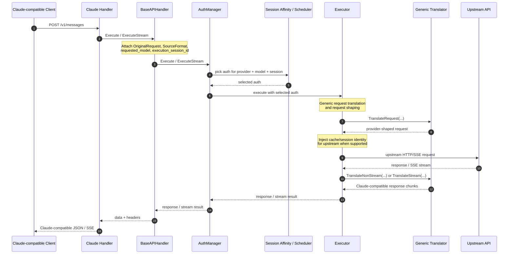
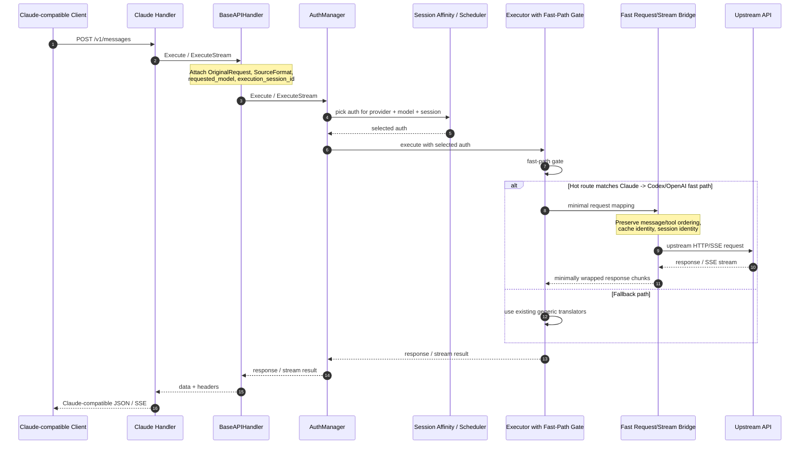

# SDK Advanced: Executors, Translators, and Maintainable Extensions

This guide explains how to extend the embedded proxy with custom providers and schemas using the SDK while keeping your changes easy to carry forward when upstream evolves.

You will:
- implement a provider executor that talks to your upstream API
- register request/response translators for schema conversion
- register models so they appear in `/v1/models`
- keep custom logic on public SDK surfaces instead of patching internal hot paths

The examples use Go 1.26+ and the v6 module path.

## Concepts

- Provider executor: a runtime component implementing `auth.ProviderExecutor` that performs outbound calls for a given provider key, such as `gemini`, `claude`, or `codex`.
- Request preparer: an optional capability implemented by executors that need to mutate raw outbound HTTP requests before they are sent.
- Translator registry: schema conversion functions routed by `sdk/translator`. The built-in handlers already translate between OpenAI, Gemini, Claude, and Codex formats; you can register new ones.
- Model registry: the global registry used to publish models per auth/client so they appear in `/v1/models` and participate in routing.

## Prefer the Upstream-Safe Integration Style

If you want to keep rebasing or merging from upstream regularly, prefer this shape:

1. Put your custom executor and translators in your own package or your own `main` package.
2. Wire them in through `cliproxy.NewBuilder()`, `WithCoreAuthManager(...)`, `WithHooks(...)`, and `translator.Register(...)`.
3. Avoid editing `sdk/cliproxy/service.go` or depending on `internal/...` packages unless you are intentionally taking on merge-maintenance cost.

That keeps your customization close to the public SDK surface and reduces the chance that upstream changes overwrite your work.

For a working example, start from `examples/custom-provider/main.go`.

## 1) Implement a Provider Executor

Create a type that satisfies the current `auth.ProviderExecutor` interface.

```go
package myprov

import (
  "context"
  "errors"
  "fmt"
  "net/http"

  coreauth "github.com/router-for-me/CLIProxyAPI/v6/sdk/cliproxy/auth"
  clipexec "github.com/router-for-me/CLIProxyAPI/v6/sdk/cliproxy/executor"
)

type Executor struct{}

func (Executor) Identifier() string { return "myprov" }

// Optional: mutate outbound HTTP requests with credentials.
func (Executor) PrepareRequest(req *http.Request, a *coreauth.Auth) error {
  if req == nil || a == nil {
    return nil
  }
  if a.Attributes != nil {
    if apiKey := a.Attributes["api_key"]; apiKey != "" {
      req.Header.Set("Authorization", "Bearer "+apiKey)
    }
  }
  return nil
}

func (Executor) Execute(ctx context.Context, a *coreauth.Auth, req clipexec.Request, opts clipexec.Options) (clipexec.Response, error) {
  // Build an HTTP request from req.Payload, send it upstream, and return provider JSON.
  return clipexec.Response{Payload: []byte(`{"ok":true}`)}, nil
}

func (Executor) ExecuteStream(ctx context.Context, a *coreauth.Auth, req clipexec.Request, opts clipexec.Options) (*clipexec.StreamResult, error) {
  ch := make(chan clipexec.StreamChunk, 1)
  go func() {
    defer close(ch)
    ch <- clipexec.StreamChunk{Payload: []byte("data: {\"done\":true}\n\n")}
  }()
  return &clipexec.StreamResult{Chunks: ch}, nil
}

func (Executor) Refresh(ctx context.Context, a *coreauth.Auth) (*coreauth.Auth, error) {
  // Optionally refresh tokens and return updated auth.
  return a, nil
}

func (Executor) CountTokens(context.Context, *coreauth.Auth, clipexec.Request, clipexec.Options) (clipexec.Response, error) {
  return clipexec.Response{}, errors.New("count tokens not implemented")
}

func (Executor) HttpRequest(ctx context.Context, a *coreauth.Auth, req *http.Request) (*http.Response, error) {
  if req == nil {
    return nil, fmt.Errorf("myprov executor: request is nil")
  }
  if err := (Executor{}).PrepareRequest(req, a); err != nil {
    return nil, err
  }
  return http.DefaultClient.Do(req.WithContext(ctx))
}
```

Notes:
- `ExecuteStream` now returns `*clipexec.StreamResult`, not just a channel.
- The current interface also requires `CountTokens` and `HttpRequest`.
- `PrepareRequest` is still optional; implement it when raw HTTP credential injection is useful.

Register the executor before starting the service:

```go
package main

import (
  "strings"

  myprov "example.com/myapp/myprov"
  sdkAuth "github.com/router-for-me/CLIProxyAPI/v6/sdk/auth"
  "github.com/router-for-me/CLIProxyAPI/v6/sdk/cliproxy"
  coreauth "github.com/router-for-me/CLIProxyAPI/v6/sdk/cliproxy/auth"
  "github.com/router-for-me/CLIProxyAPI/v6/sdk/config"
)

func buildService(cfg *config.Config, cfgPath string) (*cliproxy.Service, error) {
  tokenStore := sdkAuth.GetTokenStore()
  if dirSetter, ok := tokenStore.(interface{ SetBaseDir(string) }); ok {
    dirSetter.SetBaseDir(cfg.AuthDir)
  }

  core := coreauth.NewManager(tokenStore, nil, nil)
  core.RegisterExecutor(myprov.Executor{})

  hooks := cliproxy.Hooks{
    OnAfterStart: func(s *cliproxy.Service) {
      models := []*cliproxy.ModelInfo{
        {ID: "myprov-pro-1", Object: "model", Type: "myprov", DisplayName: "MyProv Pro 1"},
      }
      for _, a := range core.List() {
        if strings.EqualFold(a.Provider, "myprov") {
          cliproxy.GlobalModelRegistry().RegisterClient(a.ID, "myprov", models)
        }
      }
    },
  }

  return cliproxy.NewBuilder().
    WithConfig(cfg).
    WithConfigPath(cfgPath).
    WithCoreAuthManager(core).
    WithHooks(hooks).
    Build()
}
```

If your auth entries use provider `"myprov"`, the manager routes requests to your executor.

## 2) Register Translators

The handlers accept OpenAI, Gemini, Claude, and Codex inputs. To support a new provider format, register translation functions in `sdk/translator`'s default registry.

Direction matters:
- request: register from inbound schema to provider schema
- response: register from provider schema back to inbound schema

Example: convert OpenAI Chat -> MyProv Chat and back.

```go
package myprov

import (
  "context"

  sdktr "github.com/router-for-me/CLIProxyAPI/v6/sdk/translator"
)

const (
  FOpenAI = sdktr.Format("openai.chat")
  FMyProv = sdktr.Format("myprov.chat")
)

func init() {
  sdktr.Register(
    FOpenAI,
    FMyProv,
    func(model string, raw []byte, stream bool) []byte {
      return convertOpenAIToMyProv(model, raw, stream)
    },
    sdktr.ResponseTransform{
      Stream: func(ctx context.Context, model string, originalReq, translatedReq, raw []byte, param *any) [][]byte {
        return convertStreamMyProvToOpenAI(model, originalReq, translatedReq, raw)
      },
      NonStream: func(ctx context.Context, model string, originalReq, translatedReq, raw []byte, param *any) []byte {
        return convertMyProvToOpenAI(model, originalReq, translatedReq, raw)
      },
    },
  )
}
```

When the OpenAI handler receives a request that should route to `myprov`, the pipeline uses the registered transforms automatically.

## 3) Register Models

Expose models under `/v1/models` by registering them in the global model registry using the auth ID and provider name.

```go
models := []*cliproxy.ModelInfo{
  {ID: "myprov-pro-1", Object: "model", Type: "myprov", DisplayName: "MyProv Pro 1"},
}
cliproxy.GlobalModelRegistry().RegisterClient(authID, "myprov", models)
```

A practical pattern is to register models in a startup hook after auths are loaded, as shown in the `buildService(...)` example above.

If your auth set changes dynamically, re-register or unregister models alongside auth lifecycle changes.

## Credentials and Transports

Useful hooks for outbound transport control:

- `Manager.SetRoundTripperProvider(...)` injects a per-auth `http.RoundTripper`.
- `PrepareRequest(...)` lets an executor mutate raw HTTP requests before send.
- `Manager.InjectCredentials(req, authID)` delegates credential injection through the registered executor when it implements `RequestPreparer`.

Example:

```go
core.SetRoundTripperProvider(myProvider) // returns transport per auth
```

In the default builder path, the service already installs a default round-tripper provider. Only override it when you need custom transport behavior such as per-auth proxying or custom TLS settings.

## Lifecycle and Data Flow

A request flows through these stages from the moment a Claude-compatible client calls `/v1/messages` until the response is fully delivered:

```
1. Handler          Receives HTTP request, parses body, attaches metadata
                    (OriginalRequest, SourceFormat, requested_model,
                     execution_session_id).

2. BaseAPIHandler   Calls Execute / ExecuteStream on the AuthManager.

3. AuthManager      Delegates to the session-affinity selector to pick an
                    auth entry for the target provider + model + session.

4. Selector         Uses a priority chain to derive a session key:
                      metadata.user_id (Claude Code)
                    > X-Session-ID header
                    > metadata.user_id (other)
                    > conversation_id
                    > message hash fallback
                    Sticky selection keeps the same auth across turns.

5. Executor         Receives the selected auth and request payload.
                    - Injects credentials (PrepareRequest / InjectCredentials).
                    - Translates the request to provider format via the
                      translator registry (or fast-path mapper if eligible).
                    - Applies target-specific request shaping before the
                      outbound call. For example, Claude-upstream paths apply
                      cloaking and cache-control rules, while Codex/OpenAI
                      paths apply their own provider-specific normalization.
                    - Sends the outbound HTTP/SSE request to the upstream API.

6. Upstream API     Returns response JSON or SSE stream.

7. Executor (return path)
                    - Translates the response back to the inbound schema
                      (or wraps minimally on the fast path).
                    - Returns Response or StreamResult to the AuthManager.

8. Handler          Writes the final Claude-compatible JSON or forwards
                    the SSE stream to the client with keep-alive.
```

**Ownership boundaries**: handlers own HTTP lifecycle; the AuthManager owns auth selection and retry orchestration; executors own provider communication and schema translation. Custom extensions (executors, translators) plug in at stage 5–7 without touching the other stages.

## Error Handling and Retry Strategy

### Upstream errors (429 / 5xx)

The AuthManager handles retry orchestration before the response reaches the handler:

- On a **429 (rate limit)**, the auth entry's `Quota.Exceeded` flag is set and `Quota.NextRecoverAt` is advanced with progressive backoff (`Quota.BackoffLevel`). The selector skips this auth on subsequent requests until the cooldown expires.
- On a **5xx (server error)**, the auth or model-level `NextRetryAfter` is set. The manager may retry with a different auth entry if one is available.
- The per-auth retry count can be overridden via the auth file metadata key `request_retry` (or `request-retry`). Set to `0` to disable retries for a specific credential.
- Per-model state (`ModelStates[model].Unavailable`, `NextRetryAfter`) allows fine-grained cooldown without disabling the entire auth entry.
- Cooling can be disabled per-auth via the metadata key `disable_cooling` for debugging.

For custom executors, return errors with enough context for the manager to classify them. In practice that means exposing an HTTP-like status code, and optionally `RetryAfter()` for 429-style cooldowns:

```go
type statusErr struct {
    code       int
    msg        string
    retryAfter *time.Duration
}

func (e statusErr) Error() string              { return e.msg }
func (e statusErr) StatusCode() int            { return e.code }
func (e statusErr) RetryAfter() *time.Duration { return e.retryAfter }

return clipexec.Response{}, statusErr{
    code: http.StatusTooManyRequests,
    msg:  "upstream returned 429",
}
```

### Context cancellation and resource cleanup

- When the client disconnects mid-stream, `ctx.Done()` fires. Executors must propagate the context to all outbound HTTP calls (`req.WithContext(ctx)`).
- For `ExecuteStream`, close the SSE reader and the chunk channel promptly when the context is cancelled. The built-in `StreamResult` consumer in the handler already selects on `ctx.Done()`.
- Custom executors should use `defer` to guarantee cleanup:

```go
func (e Executor) ExecuteStream(ctx context.Context, a *coreauth.Auth, req clipexec.Request, opts clipexec.Options) (*clipexec.StreamResult, error) {
    httpReq, _ := http.NewRequestWithContext(ctx, "POST", upstreamURL, body)
    resp, err := client.Do(httpReq)
    if err != nil {
        return nil, err
    }

    ch := make(chan clipexec.StreamChunk, 8)
    go func() {
        defer close(ch)
        defer resp.Body.Close()
        scanner := bufio.NewScanner(resp.Body)
        for scanner.Scan() {
            select {
            case <-ctx.Done():
                return
            case ch <- clipexec.StreamChunk{Payload: scanner.Bytes()}:
            }
        }
    }()
    return &clipexec.StreamResult{Chunks: ch}, nil
}
```

### Stream channel write safety

- Always use a buffered channel (`make(chan StreamChunk, N)`) to reduce goroutine blocking.
- Always `select` on `ctx.Done()` when writing to the channel — a slow or disconnected consumer can block the goroutine indefinitely otherwise.
- Always `defer close(ch)` in the sending goroutine so the consumer detects completion.
- Never write to a closed channel; the single-writer-closes pattern above prevents this naturally.

## Testing Tips

- Enable request logging: management API GET/PUT `/v0/management/request-log`
- Toggle debug logs: management API GET/PUT `/v0/management/debug`
- Hot reload changes in `config.yaml` and `auths/` are picked up automatically by the watcher
- Keep at least one regression test that exercises your registered translator in both stream and non-stream modes

## Performance-Sensitive Compatibility Layers

If you later build a Codex/OpenAI -> Anthropic compatibility surface, keep this guide's main rule in mind: prefer a thin edge translation layer over deep hot-path rewrites.

For this SDK guide, the practical takeaway is simple:

- preserve stable cache and session identity across turns
- minimize streaming reassembly unless the downstream contract requires it
- keep provider-specific performance tuning separate from your base SDK extension layer

Detailed bridge design notes are better kept in a separate implementation document, because those decisions tend to depend on current internal behavior and change more often than the public SDK surface.

## Architecture Flows

The diagrams below show the current hot path and the executor fast path now used for a Claude-compatible surface over Codex/OpenAI-style upstreams.

### Current architecture



Current performance profile:

- Cache preservation mostly comes from stable auth selection and session affinity in the manager/selector layer.
- Extra latency mostly comes from generic request translation and chunk-by-chunk SSE translation.
- This is a good default when maintainability and upstream sync are more important than absolute hot-path efficiency.

### Advanced fast-path architecture

This architecture now exists for the Claude -> Codex and Claude -> OpenAI hot routes inside the built-in executors. It is still an internal optimization, not a public SDK extension point, and it should be treated as an implementation detail that may evolve with executor internals.



Fast-path properties:

- Cache hit preservation can improve because the upstream sees a more stable request shape, not just a stable auth/account.
- Local translation overhead is lower because the hottest path avoids unnecessary JSON rewriting and reduces SSE event reconstruction.
- In the 2026-04-22 manual A/B validation for this repo, cache identity was preserved and cache stability looked slightly better, but end-to-end latency was effectively at parity under realistic upstream variance. Do not assume a broad latency or tail-latency win without measuring your own route.
- The manager, selector, and scheduler stay reusable, so upstream-sync survivability remains acceptable.

### Where the wins come from

#### Cache retention

- Reuse the existing session-affinity path so a logical conversation stays on the same auth/account.
- Preserve stable upstream cache identity such as `prompt_cache_key`, `Session_id`, and Claude-side `metadata.user_id` derivation.
- Avoid generic request normalization that can reorder tools, alter cache breakpoints, or otherwise change request shape across turns.

#### Speed

- Keep handler and manager orchestration unchanged.
- Move optimization into the executor hot path where generic translation currently happens.
- Prefer direct or lightly wrapped stream forwarding over chunk-by-chunk semantic reconstruction.

### Recommended implementation boundary

For the advanced path, the safest boundary is:

- keep handlers, `AuthManager`, session affinity, and scheduler behavior intact
- add a fast-path gate inside the executor path for the Claude-compatible hot route
- fall back to the existing translator registry when the request does not match the fast-path contract
- treat rollback as a code-level rollback unless you add your own runtime flag; the built-in fast path does not currently expose a dedicated config switch to disable it at runtime

That gives you a performance-oriented architecture without turning the whole project into a hard-to-rebase fork.

## Choosing Where to Customize

For long-lived maintainability, use this rule of thumb:

- customize with SDK public surfaces when you are adding a provider or schema
- customize inside `internal/...` only when you are intentionally changing built-in provider behavior
- avoid patching hot-path internals just to prototype a new provider, because those are the areas most likely to drift with upstream work

That means:

- prefer `examples/custom-provider/main.go` style composition for custom providers
- prefer `sdk/translator.Register(...)` for schema adaptation
- prefer `cliproxy.GlobalModelRegistry()` for `/v1/models` exposure
- avoid making `sdk/cliproxy/service.go` your main customization point unless you are maintaining a fork on purpose

## Maintenance Note

When you review this guide against newer upstream versions, re-check these specific contracts first:

1. `sdk/cliproxy/auth/conductor.go`
   - `ProviderExecutor`
   - `RequestPreparer`
   - `Manager.InjectCredentials(...)`
2. `sdk/cliproxy/executor/types.go`
   - `Request`
   - `Response`
   - `StreamResult`
3. `sdk/translator/types.go` and `sdk/translator/registry.go`
   - translator callback signatures
   - default registry behavior
4. `sdk/cliproxy/model_registry.go`
   - global model registration surface
5. `examples/custom-provider/main.go`
   - the closest in-repo example of the recommended integration style

If those contracts still match, your custom provider integration should usually survive upstream updates with only minor adjustments.
